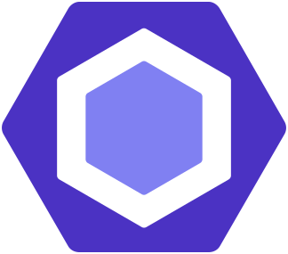
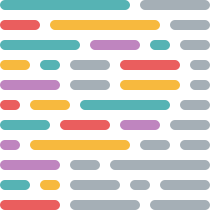

<h1 align="center">Hi 👋, I'm David Castrillón</h1>
<h3 align="center">FullStack Developer passionate about building complete web applications</h3>

<h3 align="center">About Me</h3>

FullStack Developer with nearly 10 years of experience across QA, frontend, and backend, specializing in building complete web applications from architecture to user experience. I'm driven to understand the complete product to contribute technical value from a holistic perspective, constantly questioning assumptions to improve both outcomes and development processes. I naturally act as a bridge between technical and product teams, informally coordinating team members and fostering collaboration across areas like backend, infrastructure, and architecture. Outside of code, I recharge my curiosity by exploring game strategy mechanics and global culinary traditions that fuel my innovative and methodical approach.

<h3 align="center">Technical Skills</h3>

  

    <h4>Frontend</h4>
    
    
    
    
    
    
    
    
  

   
  
  <!-- Backend -->
  

    <h4>Backend</h4>
    
    
    
     
     
  

  
  <!-- Tools -->
  

    <h4>Tools</h4>
    
    
    
  

  <!-- IA Tools -->
  

    <h4>Tools</h4>
    
    
    
  

<h3 align="center">Connect with Me</h3>

  
  
  

   
  Icons courtesy of <a title="svgl.app" href="https://svgl.app/">svgl.app</a>

